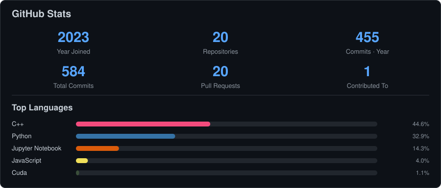
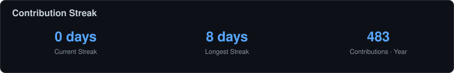
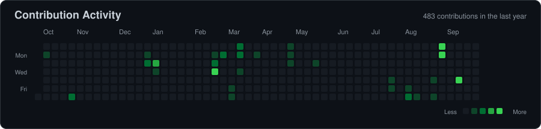

# Nikita Abramov

### AI / ML · CUDA · Robotics · Audio ML

4th-year student at **Novosibirsk State University (NSU)**.  
I build and explore projects in **CUDA, AI/ML, and Audio ML**, with a particular interest in efficient inference and applied machine learning.

---

## About me

- Research and engineering in **AI/ML and efficient neural-network inference**
- **CUDA, PyTorch, ONNX Runtime** and performance-oriented ML systems
- **Computer Vision:** detection, tracking and human attribute recognition
- **Robotics:** ROS 2, autonomous navigation and vision-based control
- **Audio ML:** using AI/ML for audio analysis, sound event recognition, and intelligent audio processing

---

## Highlights

- 🌍 **SMILES 2026** — participant of the international Machine Learning summer school organized by **Skoltech AI Center and Nanjing University**  
  Worked on **[RNS-based LLM inference acceleration](https://github.com/Nek1tt/rns-llm)** on NVIDIA GPUs, focusing on CUDA optimization and Transformer inference

## Featured projects

---

## Tech stack

**AI / ML / CV**  
`Python` · `PyTorch` · `ONNX Runtime` · `OpenCV` · `NumPy` · `scikit-learn`

**GPU / Systems / Robotics**  
`CUDA` · `C++` · `ROS 2` · `Gazebo` · `Linux`

**Backend / Engineering**  
`FastAPI` · `WebSocket` · `Docker` · `Git` · `GitHub Actions`

---

## GitHub statistics

 

 

